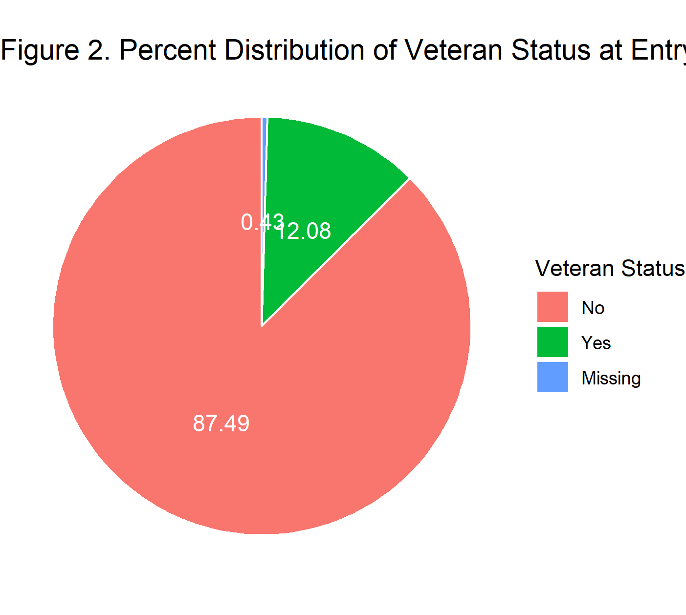
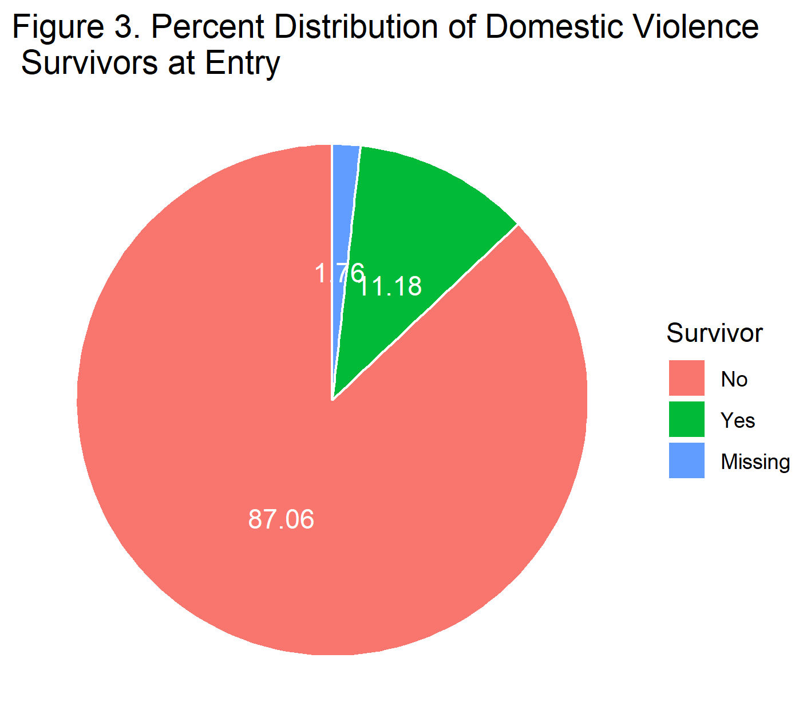

```{r setup, include=FALSE}
knitr::opts_chunk$set(echo = FALSE)
library(tidyverse)
first<-read.delim('../data/analytic_first.tsv', sep="\t", header=TRUE, na.strings = c("", "NA"))
```

## Introduction
Urban Ministries of Durham (UMD) is an organization that connects with the community to end homelessness and fight poverty.  UMD has three main programs: the Community Shelter, the Community Cafe, and the Food Pantry and Clothing Closet.  UMD has collected data from the shelter recording information on each visit to the center.  This includes data regarding clients upon entry to and exit from the shelte such as age, gender, race, mental health, income, insurance, and many other variables.

The overall objective of this project is to characterize the clients who use the shelter.  Of interest, this project intends to determine:

1. Who uses the shelter?
2. How long do clients stay at the shelter?
3. What predicts how long clients stay at the shelter?
4. What predicts a return to the shelter?

These questions are important to discover who is using the shelter and how the shelter can improve client outcomes.  Ideally, the results of this project will provide recommendations that guide interventions to end homelessness.

## Methods

There are a variety of data tables from the shelter side of UMD.  The following Table describes the tables used in this analysis and the relevant information/variables.  All data is linked by EE UID for the unique record and by Client ID.

| 	Data Table 	     | 	Variables	 		      |
|:---------------------------|:---------------------------------------|
|ENTRY_EXIT_191102.tsv	     | Entry and Exit dates, exit destination |
|CLIENT_191102.tsv	     | Client Demographics 		      |
|DISABILITY_ENTRY_191102.tsv | Disabilities at entry                  |
|DISABILITY_EXIT_191102.tsv  | Disabilities at exit                   |
|EE_UDES_191102.tsv 	     | Living situation prior to entry        |
|HEALTH_INS_ENTRY_191102.tsv | Health insurance at entry              |
|HEALTH_INS_EXIT_191102.tsv  | Health insurance at exit               |
|INCOME_ENTRY_191102.tsv     | Income at entry                        |
|INCOME_EXIT_191102.tsv      | Income at exit                         |
|NONCASH_ENTRY_191102.tsv    | Noncash benefits at entry              |
|NONCASH_EXIT_191102.tsv     | Noncash benefits at exit               |

To address study questions 1-3, the analysis will focus on a client's **first** visit to the shelter.  Characteristics at entry will be used to predict how long a client stays at the center using linear regression.

To address study question 4, the analysis will focus on whether a client had a second visit to the shelter or not as of 11/2/2019.  Characteristics at a client's first exit from the center will be used to predict return using logistic regression.

## Results
### Client Characteristics
There were `r length(first$Client.ID)` clients whose first visit to the UMD shelter occurred between `r min(as.Date(first$Entry.Date))` and `r max(as.Date(first$Entry.Date))`.  The average age of clients who visited the shelter was `r round(mean(first$Client.Age.at.Entry))` years old.  The majority of clients (`r round((length(which(first$Client.Gender=='Male'))/length(first$Client.Gender))*100)`%) were male.  Similarly, `r round((length(which(first$Client.Primary.Race=='Black or African American'))/length(first$Client.Primary.Race))*100)`% of clients were Black or African American.  Figure 1 shows the distribution of clients by age, gender and race.

{width=65%}

At entry to the shelter, clients were also asked whether they were veterans, whether they had experienced domestic violence, and their living situation prior to entering the shelter.  As shown in Figures 2, `r round((length(which(first$Client.Veteran.Status=='Yes'))/length(first$Client.Veteran.Status))*100)`% of clients were veterans.  Meanwhile, `r round((length(which(first$Domestic.violence.victim.survivor=='Yes'))/length(first$Domestic.violence.victim.survivor))*100)`% of clients had experienced domestic violence as shown in Figure 3.

{width=65%}
{width=65%}

As shown in Figure 4, The majority of clients came to shelter after living at a friend or family's place (`r round((length(which(first$Prior.Living=='FRIEND or FAMILY'))/length(first$Prior.Living))*100)`%) or from a not habitable place (`r round((length(which(first$Prior.Living=='NOT HABITABLE'))/length(first$Prior.Living))*100)`%).

{width=65%}

At entry to the shelter, clients were also asked whether they had any disability.  Most clients did not report any disability or left the question blank.  Of those who did respond, many reported a mental health problem.  Figure 5 shows the distributions of how clients responded to the disability questions.

{width=65%}

Health insurance information was also acquired from clients.  Most clients did not have any health insurance.  Of those who did have insurance, the majority had Medicaid.  Figure 6 shows the distributions client's health insurance.

{width=65%}

## Shelter Length of First Stay 

## Return to Shelter

# Conclusions

