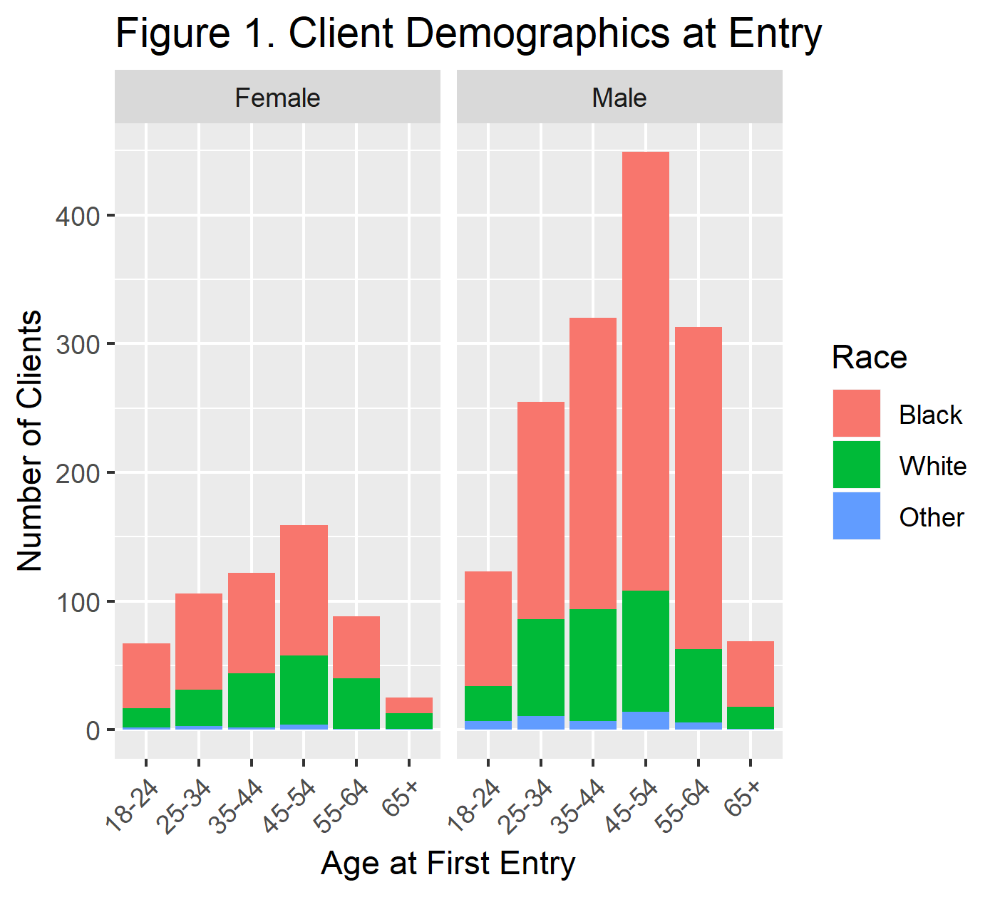
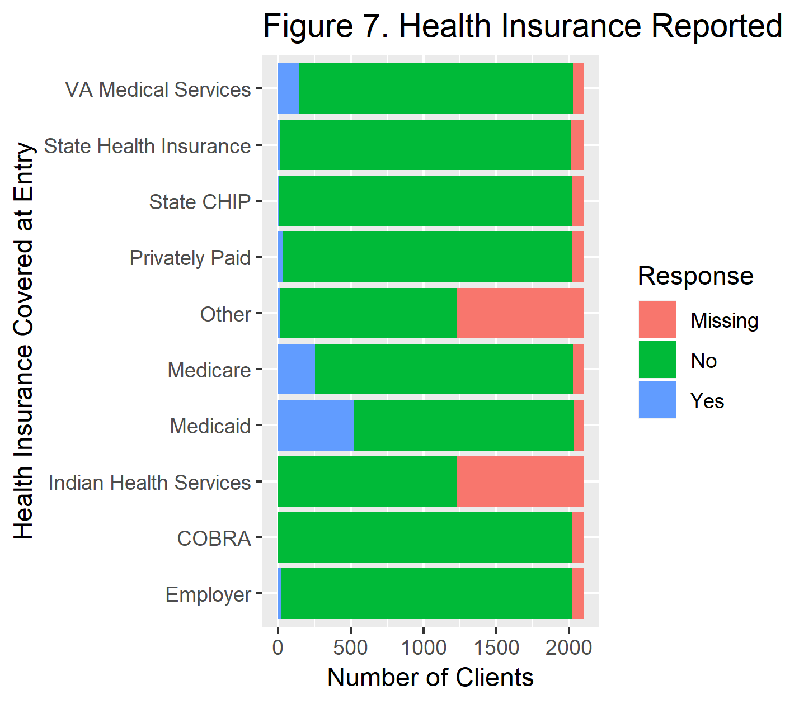
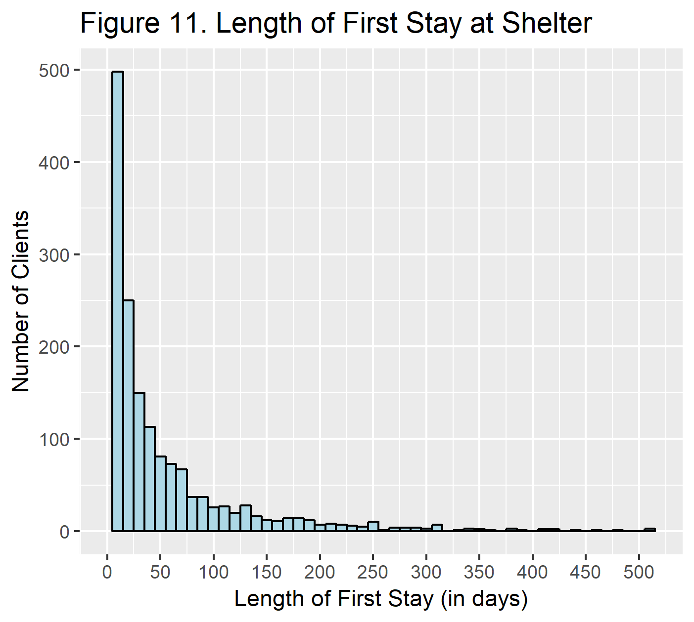
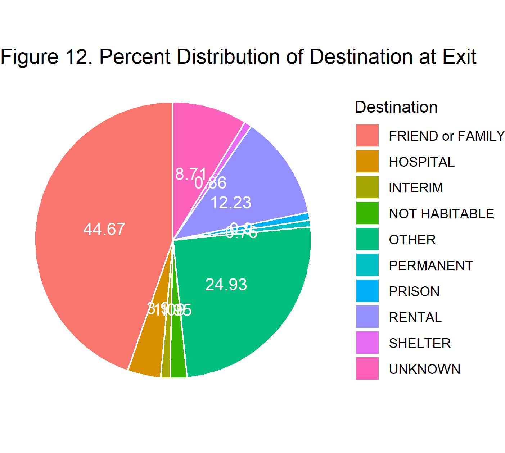

```{r setup, include=FALSE}
knitr::opts_chunk$set(echo = FALSE)
library(tidyverse)
#setwd("C:/Users/tshin/Documents/GitHub/bios611-projects-fall-2019-tshing17/project_3/")
first_entry<-read.delim('./data/analytic_first_entry.tsv', sep="\t", header=TRUE, na.strings = c("", "NA"))
first_exit<-read.delim('./data/analytic_first_exit.tsv', sep="\t", header=TRUE, na.strings = c("", "NA"))
```

## Introduction
Urban Ministries of Durham (UMD) is an organization that connects with the community to end homelessness and fight poverty.  UMD has three main programs: the Community Shelter, the Community Cafe, and the Food Pantry and Clothing Closet.  UMD has collected data from the shelter recording information on each visit to the center.  This includes data regarding clients upon entry to and exit from the shelter such as age, gender, race, mental health, income, insurance, and many other variables.

The overall objective of this project is to characterize the clients who use the shelter.  Of interest, this project intends to determine:

1. Who uses the shelter?
2. Are clients the same at entry and exit to the shelter?
3. What predicts a return to the shelter?

These questions are important to discover who is using the shelter and how the shelter can improve client outcomes.  A comparison of client responses to questions before and after their stay will be performed.

Ideally, the results of this project will provide recommendations that guide interventions to end homelessness.

## Methods

There are a variety of data tables from the shelter side of UMD.  The following Table describes the tables used in this analysis and the relevant information/variables.  All data is linked by EE UID for the unique record and by Client ID.

| 	Data Table 	             | 	Description                                                         |
|:---------------------------|:---------------------------------------------------------------------|
|ENTRY_EXIT_191102.tsv	     | Information on shelter entry and exit dates                          |
|CLIENT_191102.tsv	         | Demographics collected during a client shelter visit                |
|DISABILITY_ENTRY_191102.tsv | Disability and medical information collected at entry to the shelter  |
|DISABILITY_EXIT_191102.tsv  | Disability and medical information collected at exit to the shelter   |
|EE_UDES_191102.tsv 	       | Living situation prior to entry                                      |
|HEALTH_INS_ENTRY_191102.tsv | Health insurance information collected at entry to the shelter        |
|HEALTH_INS_EXIT_191102.tsv  | Health insurance information collected at exit to the shelter         |
|INCOME_ENTRY_191102.tsv     | Income information collected at entry to the shelter                  |
|INCOME_EXIT_191102.tsv      | Income information collected at exit to the shelter                   |
|NONCASH_ENTRY_191102.tsv    | Non-cash benefits information collected at entry to the shelter        |
|NONCASH_EXIT_191102.tsv     | Non-cash benefits information collected at exit to the shelter         |


Study questions 1 and 2 are descriptive and focus on a client's **first** visit to the shelter.  For study question 3, the analysis will focus on whether a client had a second visit to the shelter or not as of 11/2/2019. Characteristics at a client's first exit from the center will be used to predict return using logistic regression.

## Results
### Client Characteristics
There were `r length(first_entry$Client.ID)` clients whose first visit to the UMD shelter occurred between `r min(as.Date(first_entry$Entry.Date))` and `r max(as.Date(first_entry$Entry.Date))`. Figure 1 shows the distribution of clients by age, gender and race.

{width=50%}

The average age of clients who visited the shelter was `r round(mean(first_entry$Client.Age.at.Entry))` years old.  The majority of clients (`r round((length(which(first_entry$Client.Gender=='Male'))/length(first_entry$Client.Gender))*100)`%) were male.  Similarly, `r round((length(which(first_entry$Client.Primary.Race=='Black or African American'))/length(first_entry$Client.Primary.Race))*100)`% of clients were Black or African American. 

At entry to the shelter, clients were also asked whether they were veterans, whether they had experienced domestic violence, and their living situation prior to entering the shelter.  As shown in Figures 2, `r round((length(which(first_entry$Client.Veteran.Status=='Yes'))/length(first_entry$Client.Veteran.Status))*100)`% of clients were veterans.  Meanwhile, `r round((length(which(first_entry$Domestic.violence.victim.survivor=='Yes'))/length(first_entry$Domestic.violence.victim.survivor))*100)`% of clients had experienced domestic violence as shown in Figure 3.

{width=40%}{width=37%}

As shown in Figure 4, The majority of clients came to shelter after living at a friend or family's place (`r round((length(which(first_entry$Prior.Living=='FRIEND or FAMILY'))/length(first_entry$Prior.Living))*100)`%) or from a not habitable place (`r round((length(which(first_entry$Prior.Living=='NOT HABITABLE'))/length(first_entry$Prior.Living))*100)`%).

{width=50%}

At their first visit, the majority of clients are males, Black or African-American race, and ages 45-54.  12% of clients are veterans and 11% of clients are domestic violence survivors.  Finally, most clients arrive at the shelter after living at a not habitable place.  This is closely followed by a living situation with friends or family.

### Entry and Exit Resources

#### Disability
At entry to the shelter, clients were also asked whether they had any disability.  Most clients did not report any disability or left the question blank.  Of those who did respond, many (over 500 clients) reported a mental health problem.  Figure 5 shows the distributions of how clients responded to the disability questions at entry to the shelter.  In contrast, Figure 6 shows the distributions of how clients responded to the disability questions at exit from the shelter.  The distributions are almost identical suggesting that at the first visit to the shelter, no self-reported disability responses changed between entry and exit.

{width=40%} {width=40%}

#### Health Insurance
Similarly, health insurance information was also acquired from clients at entry and exit from the shelter.  Most clients did not have any health insurance at entry to the shelter, as shown in Figure 7.  Of those who did have insurance, the majority had Medicaid.  Figure 8 shows the distributions client's health insurance at exit from the shelter.  Again, the distributions of insurance are almost identical at entry and exit from the shelter, suggesting that at the first visit to the shelter, no self-reported disability responses changed.

{width=40%} {width=40%}

#### Noncash Income
Non-cash income information was also acquired from clients at entry and exit from the shelter.  Most clients reported SNAP use at entry to the shelter, as shown in Figure 9.  Figure 10 similarly shows the distributions client's non-cash income at exit from the shelter.  According to these figures, no self-reported non-cash responses changed after during the first stay at the shelter.

{width=40%} {width=40%}

## Return to Shelter

### Length of Stay

The length of stay at the first shelter visit was determined as the difference between the date of entry to the shelter and the date of exit to the shelter.  The median number of days a client spent at the shelter during their first visit was `r median(first_exit$LOS, na.rm=TRUE)` days.  As seen in Figure 11, the majority of clients spend a short amount of time at the shelter.

{width=50%}

### Destination at Exit

Clients who leave the shelter record their next destination.  In contrast to their prior living situation before entering the shelter, a higher number of clients' destination is to stay with friends or family.  Additionally, the number of clients whose destination is a not habitable place is greatly decreased after staying at the shelter.

{width=50%}

### Regression Analysis

The number of clients who returned to the shelter was determined as clients who had more than 1 visit.  839 (`r round(839/2102)`%) clients returned to the shelter for a second visit.

Thus an exploratory analysis of what predicts a return to the shelter was performed using a logistic regression and including the variables length of stay at the shelter, the destination recorded at exit, other demographic characteristics of clients (age, race, gender, veteran status, domestic violence survivor), and self-reported records of any disability, any health insurance, any income source, and any non-cash income source.

```{r}
dat = first_exit %>%
  mutate(log_los=log(LOS+1)) %>% 
  mutate(Client.Primary.Race2 = ifelse(is.na(Client.Primary.Race)|
                                         Client.Primary.Race == 'Native Hawaiian or Other Pacific Islander'|
                                         Client.Primary.Race == 'American Indian or Alaska Native'|
                                         Client.Primary.Race == 'Asian','Other',Client.Primary.Race))

return_logit <- glm(data=dat, returned ~ log_los + Client.Age.at.Exit + Client.Gender + Client.Primary.Race2 +
                      Client.Veteran.Status + Destination + Domestic.violence.victim.survivor +Any.Disability +
                      Any.Health.Insurance + 
                      Any.Income.Source + Any.Noncash.Source, family = "binomial")

summary(return_logit)

```

According to the logistic regression model, veterans had a lower odds of returning compared to non-veterans.  However, those who reported a disability had an increased odds of returning to the shelter compared to those who did not report any disability.  Some destinations suggest a lower odds of returning to the shelter compared to those whose destination was friends and family including clients whose destinations were some interim housing (like a halfway house), other housing, permanent housing, or rental housing.

# Conclusions
Overall, according to this data set of clients first visit to the UMD shelter, there were more males than females.  Additionally, the largest age group is 45-54 years old.  There were more clients of Black race than any other race according to this data.  12% of clients were veterans.  11% were domestic violence survivors.  Over 25% were living at a not habitable place prior to coming to the shelter.  Another 25% were living were friends and family.

Knowing these demographics of who use the shelter is important to making decisions on resources available, for example the amount of clothing, food, and beds.  Additionally, demographic characteristics may also be an indicator of underrepresentation of certain popultions. The question arises of whether this is the client demographic that is more likely to be homeless or is this the client demographic that is likely to use the shelter?  Further investigation into other homeless shelters is needed to answer this question.  However, it is important to consider the latter to make sure that UMD is open to all clients who need resources.  If the latter is true, UMD should take action to make sure that women are also able to access the shelter as much as men.

Disability, health insurance, non-cash sources of income do not change between entry and exit for a visit.  This could be a good opportunity for UMD to implement programs to make clients more aware of potential resources available to them.  Clients may be eligible for some health insurance, disability, or non-cash benefits that might aid in ending their homelessness.

Clients with any self-reported disability may be more likely to return to the shelter for a second visit.  In contrast, those clients who report their destination as a rental or permanent housing are less likely to return compared to those whose destination is with friends and family.

The results of this report suggest some avenues for change at the UMD shelter which could benefit clients. Clients would benefit from additional resources at UMD that work to get clients to more stable rental and permanent housing as well as informing clients of disability and financial resources available to them.

